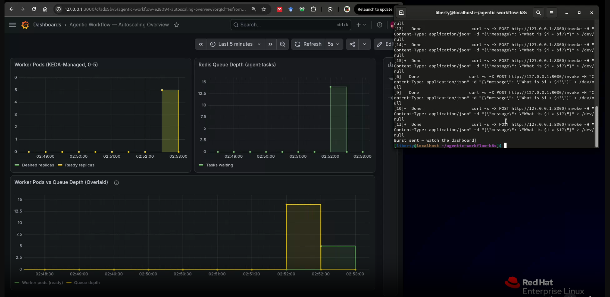
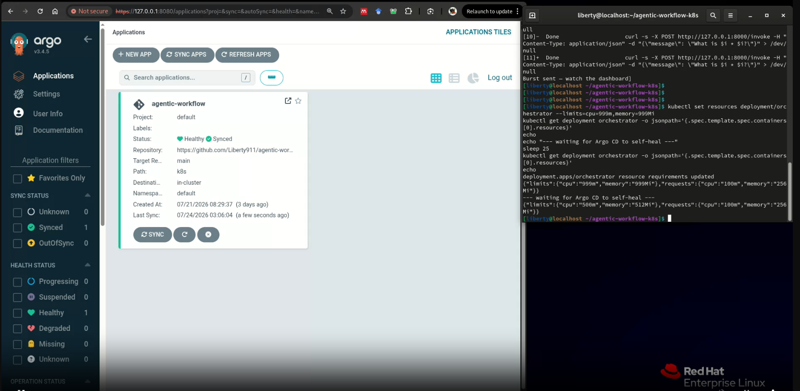

# Agentic Workflow Infrastructure on Kubernetes

**A production-grade, event-driven platform for running autonomous AI agent workflows on Kubernetes — with cost-aware autoscaling, full observability, GitOps-managed deployments, and policy-enforced security guardrails.**

---

## The Problem

Most agentic AI workflows I've seen deployed run as always-on services — burning compute 24/7 even when idle. This project treats agent tasks as *events*: a LangGraph orchestrator queues work in Redis, KEDA scales worker pods from **zero to N** based on live queue depth, the whole system is GitOps-managed through Argo CD, and OPA Gatekeeper blocks unsafe deployments before they ever reach the cluster.

---

## Architecture

```
API request
    │
    ▼
┌─────────────────────────────────────────────────────────┐
│  Kubernetes cluster                                      │
│                                                            │
│   LangGraph orchestrator  ──depth──▶  KEDA autoscaler     │
│         │                                    │            │
│         ▼                                    ▼            │
│   Redis event queue  ─────────▶  Agent worker jobs (0-N)  │
│                                        │                   │
│                                        ▼                   │
│                              Prometheus + Grafana           │
└─────────────────────────────────────────────────────────┘
    │
    ▼
Task result returned
```

An API request reaches a FastAPI orchestrator, which pushes the task onto a Redis queue and returns immediately (non-blocking). KEDA watches queue depth every 5 seconds and scales the `worker` Deployment from 0 up to 5 replicas as load arrives. Each worker runs a LangGraph agent with three tools, writes its result back to Redis, and scales back to zero once idle. Argo CD continuously reconciles the entire cluster state against this GitHub repo — every config change is a git commit, every rollback is a `git revert`.

---

## Tech Stack

| Layer | Tool |
|---|---|
| Agent orchestration | LangGraph + Groq (`openai/gpt-oss-120b`) |
| Message queue | Redis |
| Event-driven autoscaling | KEDA (`ScaledObject`, Redis list-length trigger) |
| Container orchestration | Kubernetes (`kind`, Podman rootless) |
| GitOps deployment | Argo CD (automated sync + self-heal) |
| Observability | Prometheus + Grafana + `redis_exporter` |
| Policy guardrails | OPA Gatekeeper (custom Rego policies) |
| API layer | FastAPI |
| CI-ready containers | Podman (Docker-compatible builds) |

---

## Agent Tools

| Tool | Purpose | Demonstrates |
|---|---|---|
| `order_status` | Mocked internal system lookup | Structured tool-calling against internal APIs |
| `calculator` | Arithmetic evaluation | Multi-tool routing |
| `web_search` | Live DuckDuckGo search | Real-world grounding / RAG-adjacent retrieval |

---

## Proof of Work

### KEDA Autoscaling — 0 → 5 → 0 Under Real Burst Load


A burst of 15 concurrent requests drives worker replicas from 0 to 5 in under 10 seconds; all workers scale back to zero ~30-40s after the queue drains.

### GitOps — Argo CD Sync & Self-Heal


Manually changing a Deployment's resource limits via `kubectl` is automatically reverted by Argo CD within seconds, with zero human intervention — proving the cluster's live state is continuously reconciled against git, not just deployed from it once.

### Security Guardrails — OPA Gatekeeper Admission Rejection
Deployments missing CPU/memory limits or using an unpinned `:latest` image tag are rejected **at admission time**, before they ever reach the cluster:

```
$ kubectl apply -f bad-deployment.yaml
Error from server (Forbidden): admission webhook "validation.gatekeeper.sh" denied the request:
[require-cpu-memory-limits] Container 'bad-container' is missing required resource limit 'cpu'...
[block-latest-image-tag] Container 'bad-container' uses the ':latest' tag ('nginx:latest')...
```

### Live Web-Grounded Agent Response
```json
{
  "status": "completed",
  "response": "EU AI Regulation – What's new (as of mid-2024)... [full cited summary, sourced from live search]",
  "tool_calls_made": 1
}
```

---

## Repository Structure

```
agentic-workflow-k8s/
├── src/orchestrator/        # FastAPI app — enqueues tasks, serves results
├── src/worker/               # LangGraph agent — consumes queue, runs tools
├── docker/                   # Dockerfiles + requirements per service
├── k8s/                      # Kubernetes manifests (Deployments, Services, KEDA)
├── argocd/                   # Argo CD Application definition
├── policies/opa/             # Gatekeeper ConstraintTemplates + Constraints
├── observability/            # Grafana dashboard JSON
└── docs/screenshots/         # Proof-of-work images
```

---

## Running It Locally

```bash
# 1. Cluster
kind create cluster --name agentic-workflow

# 2. Secrets (never committed — reads from local .env)
cd k8s && ./create-secret.sh

# 3. Core services
kubectl apply -f k8s/redis-deployment.yaml
kubectl apply -f k8s/orchestrator-deployment.yaml
kubectl apply -f k8s/worker-deployment.yaml

# 4. Autoscaling
helm install keda kedacore/keda --namespace keda --create-namespace
kubectl apply -f k8s/worker-scaledobject.yaml

# 5. Observability
helm install kube-prometheus-stack prometheus-community/kube-prometheus-stack -n monitoring --create-namespace
kubectl apply -f k8s/redis-exporter.yaml

# 6. GitOps
kubectl apply -f argocd/agentic-workflow-application.yaml

# 7. Guardrails
kubectl apply -f policies/opa/
```

Test:
```bash
kubectl port-forward svc/orchestrator 8000:8000 &
curl -X POST http://127.0.0.1:8000/invoke \
  -H "Content-Type: application/json" \
  -d '{"message": "What is the status of order ORD-1001?"}'
```

---

## Engineering Notes — Real Bugs, Real Fixes

This section exists because most portfolio projects show the happy path only. Here's what actually went wrong building this, and how each was diagnosed and fixed — not glossed over.

**1. Model deprecation mid-build.** Groq deprecated `llama-3.3-70b-versatile` and `llama-3.1-70b-versatile` during development. Diagnosed via the exact `model_decommissioned` API error, migrated to Groq's documented replacement (`openai/gpt-oss-120b`), which also turned out to have more reliable tool-calling.

**2. Python 3.9 vs 3.11 mismatch.** Local dev venv ran Python 3.9; code was written using `X | None` union-type syntax (3.10+ only), while the Docker image used `python:3.11-slim`. Caused a `TypeError` at class-definition time locally that wouldn't have appeared in the container. Fixed by using `Optional[X]` throughout for 3.9 compatibility.

**3. Agent over-eager re-searching.** The LLM would reformulate and re-run `web_search` multiple times per question instead of committing to one result, eventually hitting LangGraph's recursion limit. Diagnosed by adding structured logging directly inside the tool (not just around it), which proved the tool was succeeding every time — the model was just being thorough to a fault. Fixed with two layers: a hard, state-tracked tool-call cap (defense-in-depth, doesn't rely on the model cooperating) and a tightened system prompt (root-cause fix).

**4. Stale Docker build context.** After refactoring the orchestrator from a synchronous agent-runner into a thin queue-enqueuing API, a rebuild silently packaged the *old* `main.py` because the build-context copy step ran before the source file's edits were saved. Diagnosed via `ModuleNotFoundError: No module named 'graph'` in pod logs — the smoking gun that an old image was still running. Fixed by deleting and re-copying the build context explicitly rather than trusting an overwrite.

**5. Rootless Podman + `kind` on RHEL 9.** `kind create cluster` failed with a cgroup delegation error specific to rootless container runtimes on systemd. Fixed via a `Delegate=yes` systemd drop-in for the user session, requiring a full session restart (not just `daemon-reload`) to take effect — confirmed via direct `/sys/fs/cgroup` inspection rather than trusting `systemctl show` alone.

**6. Accidental secret + `.venv` exposure.** An early `git push` before `.gitignore` was correctly configured pushed a 28MB history including the full Python virtual environment. Caught by the anomalous push size, remediated by deleting the GitHub repo entirely (cleanest option for a fresh solo repo), rewriting local git history from scratch, and rotating the exposed Groq API key.

**7. KEDA vs. Argo CD self-heal conflict — resolved proactively.** Argo CD's `selfHeal: true` would fight KEDA's dynamic replica scaling, since both "own" the same field (`spec.replicas`) but disagree constantly. Resolved *before* it caused any flapping, using an explicit `ignoreDifferences` rule scoped to the worker Deployment's replica count — a known production pattern for GitOps + HPA/KEDA coexistence.

---

## License

MIT
